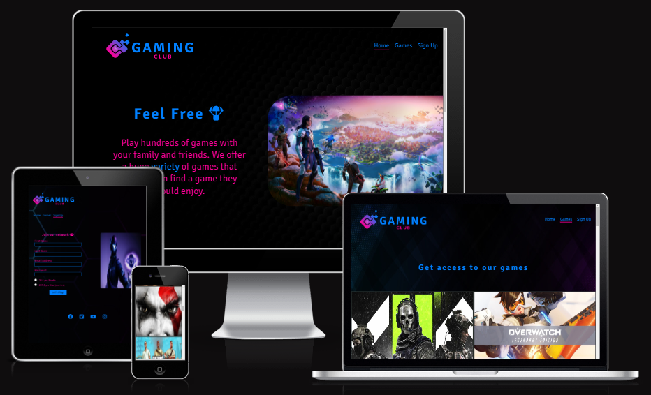
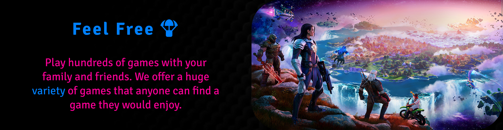
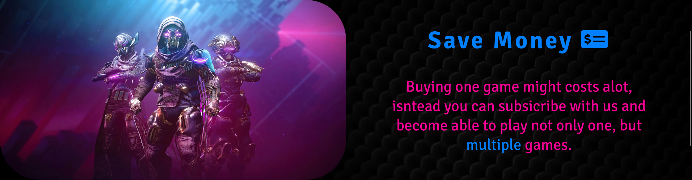
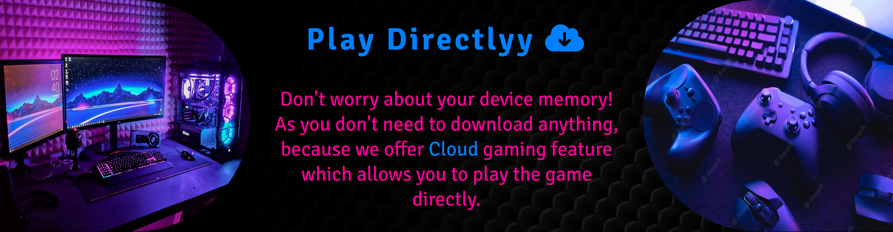
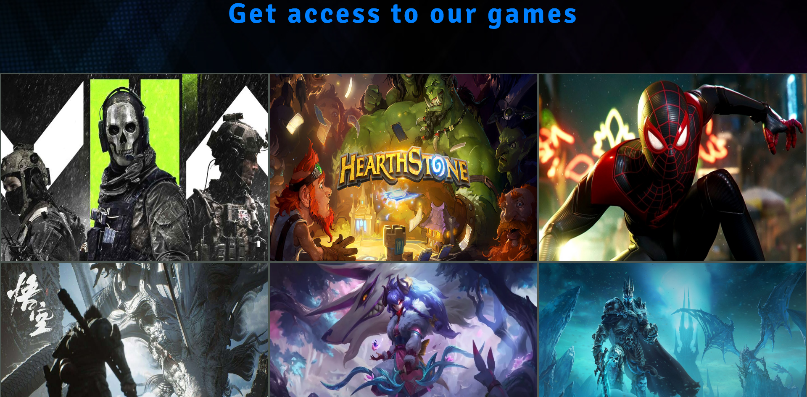
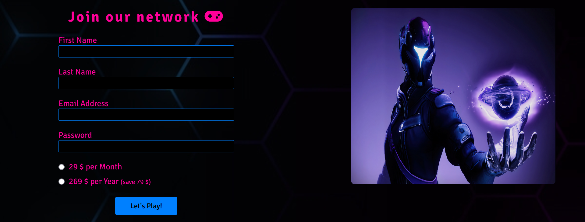
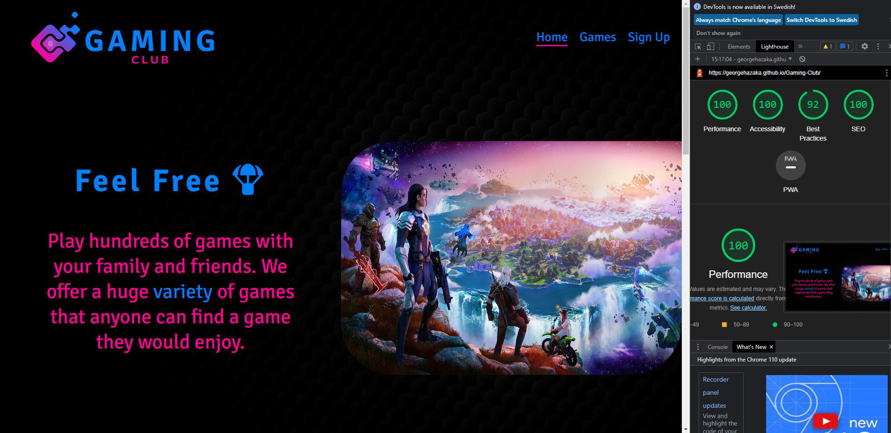
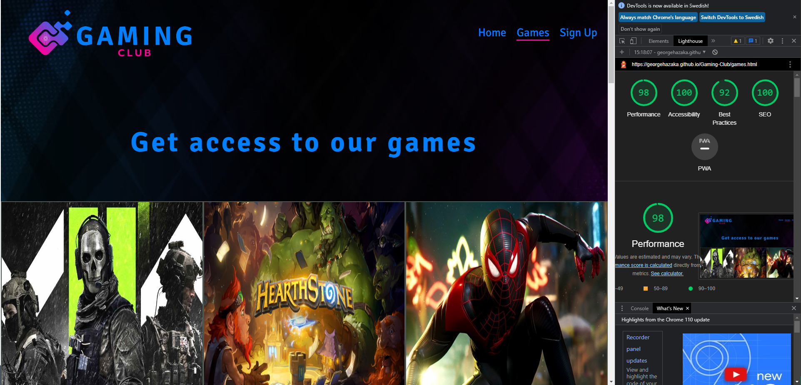
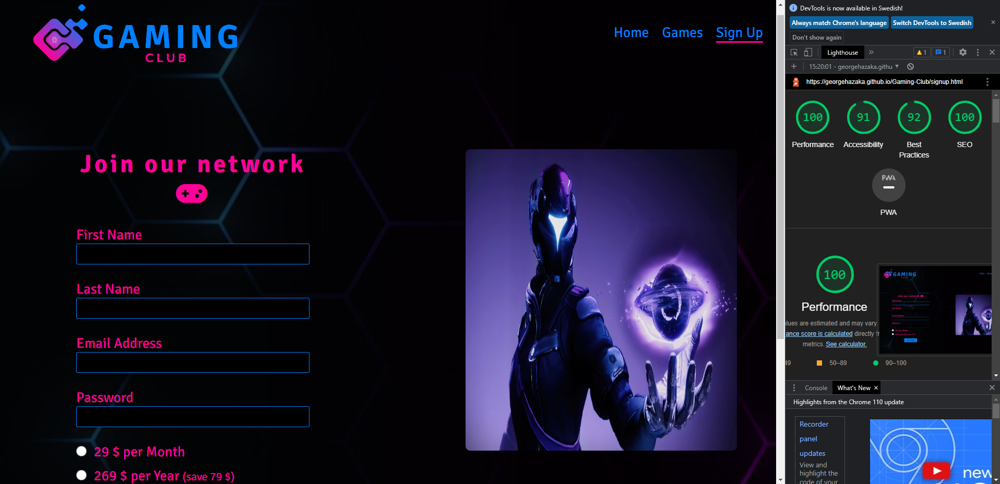

# Gaming Club

This application is designed to facilitate the process of playing without losing too much money on expensive games. Anyone can play online, alone or multiple players anytime and anywhere.

Users of this website wil be able to find all the information they need to know about Gaming Club: About the club, the games we have, sign up form and contact information. This site is targeted towards gamers who are willing to play many games but can't afford it, as this application can provide you several well-known games by only paying the monthly subscription.

## Table of Contents
----

+ [Design](#design "Design")
    + [Flow Diagram](#flow-diagram "Flow Diagram")
    + [Wireframes](#wireframes "Wireframes")
    + [Colour Scheme](#colour-scheme "Colour Scheme")
    + [Typography](#typography "Typography")
    + [Logo Design](#logo-design "Logo Design")
+ [Features](#features "Features")
    + [Existing Features](#existing-features "Existing Features")
        + [The Header](#the-header "The Header")
        + [The Section](#the-section "The Section")
        + [The Footer](#the-footer "The Footer")
        + [The Games Page](#the-games-page "The Games Page")
        + [The Sign Up Page](#the-sign-up-page "The Sign Up Page")
    + [Features Left to Implement](#features-left-to-implement "Features Left to Implement")
+ [Testing](#testing "Testing")
    + [Manual Testing](#manual-testing "Manual Testing")
    + [Validator Testing](#validator-testing "Validator Testing")
    + [Unfixed Bugs](#unfixed-bugs "Unfixed Bugs")
+ [Deployment](#deployment "Deployment")
+ [Credits](#credits "Credits")
    + [Content](#content "Content")
    + [Media](#media "Media")

## Design
----

### Flow Diagram

To structure and aid in creating the website, a basic flow diagram was created which is linked below.

[Flow Diagram](documentation/Gaming-club-diagram-finished.pdf)

### Wireframes

Please see below, a link to wireframes for the site layout.

[Wireframes](documentation/Gaming-club-wireframes-finished.pdf)

### Colour Scheme

Two main colours were used in this website which suit gaming websites. The colours are:

 

### Typography

To make the website seem like a gaming website, the following font was chosen:

[Signika Negative](https://fonts.google.com/specimen/Signika+Negative?query=sign)

### Logo Design

Created a logo for the Gaming Club website, and the logo has the shape of letter G. It was created in [Canva](https://www.canva.com)

## Features
----

### Existing Features

+ #### The Header
    + Featured at the top of the page, the header shows the club name in the left corner: GAMING CLUB that links to the Home page.
    + The navigation links are to the right: Home, Games and Sign Up which link to different pages of the website.
    + The header clearly tells the user the name of the club and website and the navigation links make the different pages of information easy to find.

+ #### The Section
    + Feel Free part makes the user feel free to play whatever game they want.
    + Shows to the user that they can play alone or with freinds and family.

     

    

    + Save Money part is to encourage the user to join the Gaming club instead of paying lots of money for a single game.

     

    

    + Play Directly part is about the Cloud feature, which allows the user to play directly. so they don't have to wait until the game is fully downloaded.
    +  Also it shows that this feature doesn't take any space in memory.

     

    

+ #### The Footer
    + The Footer section includes links to various social networks for Gaming Club.
    + It makes the user keep connected with us through social media.

+ #### The Games Page
    + The games page shows the user the games we have in Gaming Club.
    + his section provides the user to easily navigate through games.

+ #### The Sign Up Page
    + This page allows the user to create an account and start gaming right after.
    + The user has to submit their first name, last name, email address, password and choose the subscription period.
    + The user has to specify wether they want to subscripe for a month (29$) or a year (269$). Choosing the year option saves them 79$.

### Features Left to Implement
+ Add a searching bar in the Games page so that the user can type the name of the game they looking for.
+ Sort the games in categories so the the user can search for the type of games which suit them.

## Testing
----
+ I tested that the all the pages work in different browsers: Chrome, Firefox, Microsoft Edge, Brave.
+ I confirm that the project is responsive, looks good and functions on all standard screen sizes using the devtools device toolbar.
+ I confirm that the navigation bar, the home section, footer, games page and sign up page are easy to understand and readable.
+ I confirm that the sign-up form requires entries in every field, will only accept an email in the email field and one of the two radio inputs must be chosen, and you can only choose one of them. Also the submit button works properly.

### Manual Testing

| Feature | Expect | Action | Result |
| ------- | ------ | ------ | ------ |
| **Home logo button** | When clicked the home page will open | Clicked the Logo | Home page opened when clicked |
| **Home navbar button** | When clicked the home page will open | Clicked Home on the Nav bar | Home page opened when clicked |
| **Games navbar button** | When clicked the games page will open | Clicked Games on the Nav bar | Games page opened when clicked |
| **Sign Up navbar button** | When clicked the signup page will open | Clicked Sign Up on the Nav bar | Sign Up page opened when clicked |
| **Form Submit button** | Form submits when submit button is clicked | Clicked the submit button on the form | The form successfully submitted on click |
| **Social link icons** | Social link icons open relevant websites in a new tab when clicked | Clicked the social link icon | The link opened a new tab and to the correct site |
| **Games page images** | Images will change shape and opacity | Refreshed the games page | The images perform changing-shape-and-opacity animation effect correctly |

### Validator Testing
+ HTML
    + No errors were found when passing through the official [W3C validator](https://validator.w3.org/nu/?doc=https%3A%2F%2Fgeorgehazaka.github.io%2FGaming-Club%2F)
+ CSS
    + No errors were returned when passing through the official [(Jigsaw) validator](https://jigsaw.w3.org/css-validator)
+ Accessibility
    + I confirmed that the colors and fonts chosen are accessible and easy to read by running it through lighthouse in devtools.

### Unfixed Bugs
No unfixed bugs.

## Deployment
----
+ The site was deployed to GitHub pages. The steps to deploy are as follows:
    1. In the GitHub repository, navigate to the Settings tab
    2. From the Code and automation section, click on Pages
    3. From the Pages section drop-down menu, select the "main" option inside the Branch section
    4. Afterwards the page will be automatically refreshed with a detailed ribbon display to indicate the successful deployment.

The live link can be found here - [Gaming Club](https://georgehazaka.github.io/Gaming-Club/)

## Credits
----

### Content
+ The navigation bar style was taken from [Love Running](https://code-institute-org.github.io/love-running-2.0/) project
+ The code of the social media links was taken from [Love Running](https://code-institute-org.github.io/love-running-2.0/) project
+ The idea of the games page was taken from gallery page of [Love Running](https://code-institute-org.github.io/love-running-2.0/) project
+ The icons in the footer were taken from [Font Awesome](https://fontawesome.com/)
+ The icon in the signup page was taken from [Font Awesome](https://fontawesome.com/)

### Media
+ All images were taken from open source site.